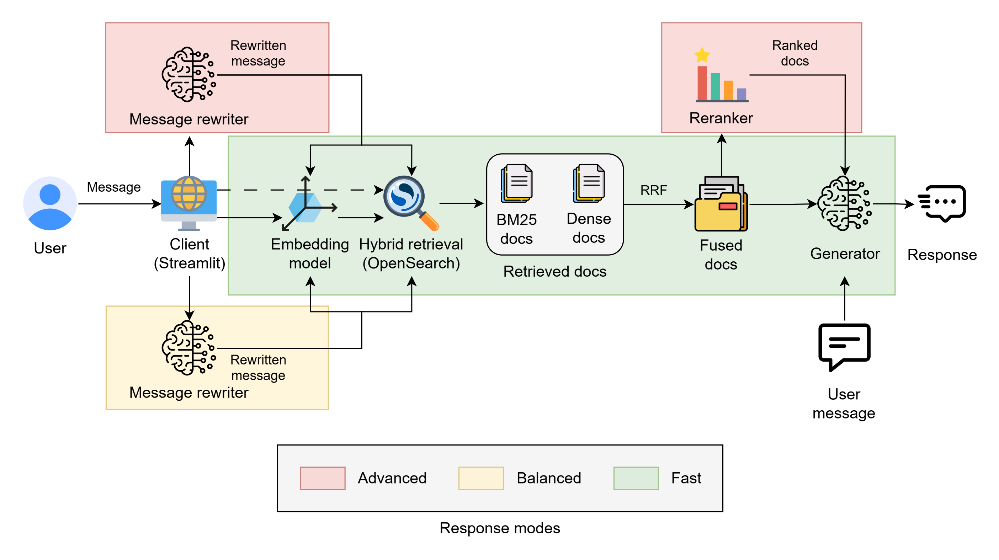
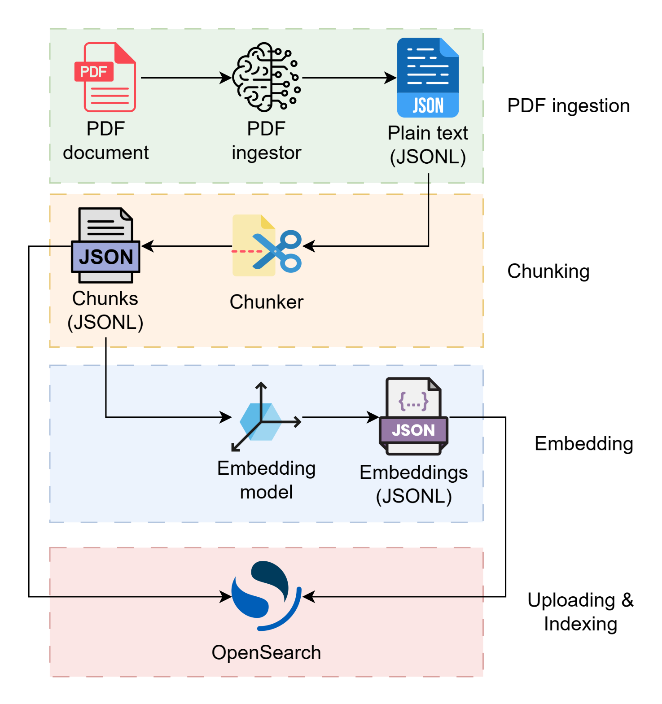
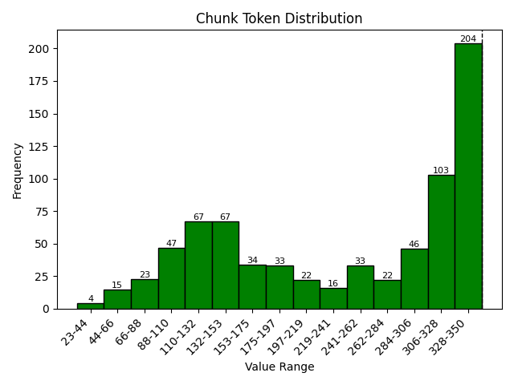
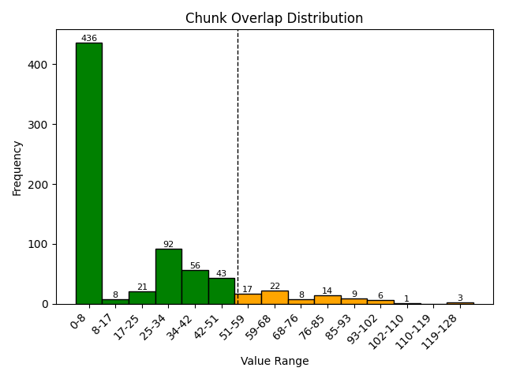
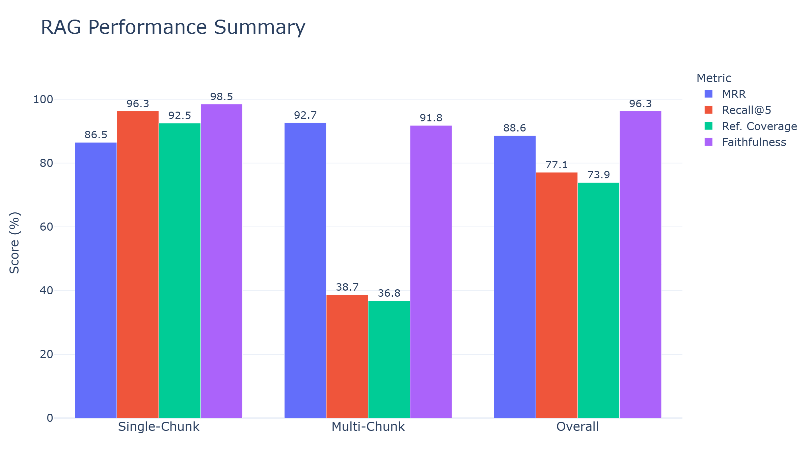
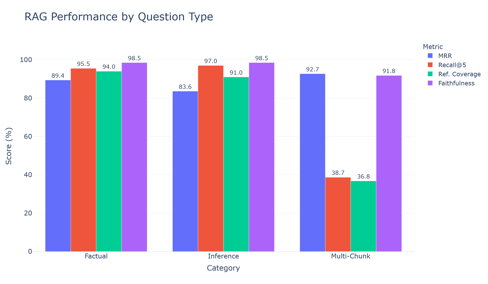
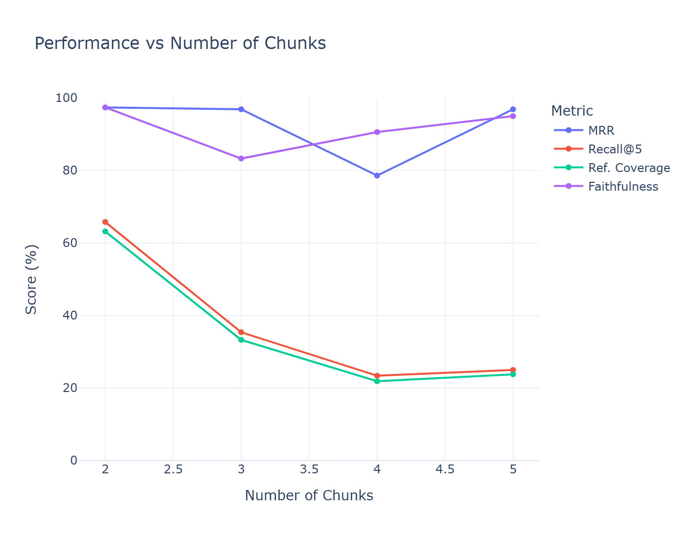
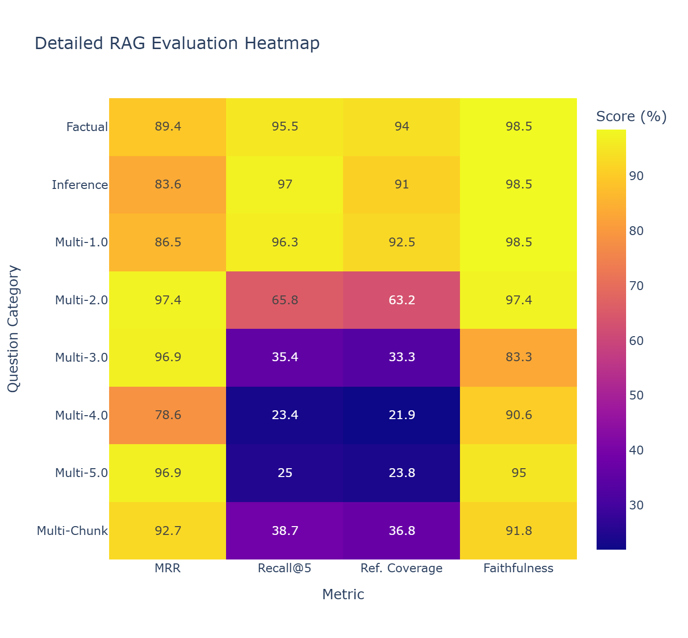

# Retrieval-Augmented Generation (RAG) System

A document question-answering system built on the **Systems Limited 2025 Annual Financial Report** using a RAG pipeline that combines hybrid retrieval (dense vector search and BM25), reranking, and large language models to generate grounded responses.

The pipeline includes document ingestion, PDF processing, chunking, embedding generation, retrieval, context selection, answer generation, and evaluation.

## System Architecture

The system consists of two primary workflows: the inference pipeline for answering user queries and the document ingestion pipeline for preparing documents for retrieval.

### Inference Flow

The inference workflow uses a multi-mode RAG pipeline that routes user queries through three execution paths. The overall flow is illustrated below:



Depending on the selected response mode, the pipeline applies different levels of query processing, retrieval refinement, and ranking:

* **Fast Mode (🟢):** Uses the raw query directly for hybrid retrieval through OpenSearch. BM25 and dense retrieval results are combined using Reciprocal Rank Fusion (RRF), and the fused context is passed to the generator.

* **Balanced Mode (🟡):** Applies query rewriting before the hybrid retrieval and RRF pipeline to improve retrieval quality.

* **Advanced Mode (🔴):** Applies query rewriting, hybrid retrieval, RRF fusion, and cross-encoder reranking to provide higher-precision context for generation.

### Document Ingestion Flow

The ingestion workflow transforms source documents into indexed representations for retrieval. The complete process is illustrated below:

<p align="center">
  
</p>

The pipeline is organized into modular stages that can be executed separately and resumed from their intermediate outputs:

* **PDF Ingestion:** Extracts content from PDF documents and converts them into structured plain text JSONL data.
* **Chunking:** Transforms extracted text into retrieval-friendly chunks while preserving relevant metadata for traceability and retrieval enhancements.
* **Embedding Generation:** Converts document chunks into vector representations.
* **Uploading & Indexing:** Uploads chunks, metadata, and embeddings to OpenSearch to support hybrid retrieval using dense vector search and BM25.

## Document Processing

The document processing pipeline transforms raw PDF documents into structured, retrieval-ready chunks while preserving document hierarchy and contextual information.

### PDF Processing

The pipeline uses an LLM-based PDF ingestion process to extract document content while preserving the original structure. Information contained in tables, infographics, and other visual elements is converted into descriptive text representations to maintain important context for retrieval.

### Chunking Strategy

The chunking pipeline is designed to preserve document semantics rather than relying on simple text splitting. It uses section-aware, token-controlled chunking with hierarchical context preservation.

Key characteristics:
- Maximum chunk size is constrained to 350 tokens.
- Higher-level sections are kept separate to avoid mixing unrelated contexts.
- Sentence-based overlap is applied to maintain continuity between chunks, with the overlap limit configured as 15% of the maximum chunk size.
- Section boundaries are respected to prevent unrelated content from being introduced through overlap.
- Document hierarchy (section and subsection context) is preserved within each chunk. Example:

> H1: Sustainability Governance
>
> H2: Governance Structure and Reporting Lines
>
> H3: Sustainability Oversight Framework
>
> Energy management is managed by the electrical function...

### Chunk Metadata

Each chunk is stored together with metadata required for traceability and retrieval enhancements, including information such as document section, page range, token count, and overlap details.

Example:

```json
{
  "metadata": {
    "chapter": "Consolidated Financial Statements",
    "page_no": "267-268",
    "total_tokens": 126,
    "total_overlap_tokens": 71
  }
}
```

### Chunking Analysis

The chunking pipeline was analyzed to verify the resulting chunk size distribution and overlap behavior.

The following visualizations show the token distribution of generated chunks and the applied overlap between consecutive chunks:





The distributions show that generated chunks adhere to the configured token constraints, while overlap generally remains within the defined limit. Occasional deviations occur when the last sentence of the previous chunk exceeds the available overlap allowance; in such cases, the complete sentence is preserved in the next chunk to maintain continuity, slightly exceeding the configured overlap limit.

### Embedding Generation

Processed chunks are converted into dense vector representations using the configured embedding model and stored alongside the original chunk data for downstream retrieval.

### Pipeline Design

The ingestion pipeline is designed for large document processing through:

* Incremental JSONL-based processing instead of loading the full dataset into memory.
* Stage-level resumability using intermediate artifacts and progress tracking.
* Batched and parallel processing where applicable to improve throughput.

## Retrieval Pipeline

The retrieval pipeline combines query optimization, sparse retrieval, dense retrieval, and optional reranking to improve the relevance of retrieved document context.

### Query Rewriting

In Balanced and Advanced modes, the pipeline applies an LLM-based message rewriting stage before retrieval. The rewriter uses the latest user message along with chat history to reformulate queries into standalone versions optimized for document retrieval.

Fast Mode bypasses this step and directly uses the original user query for retrieval.

### Hybrid Retrieval

The system performs two complementary retrieval approaches using OpenSearch as the retrieval backend:

* **Dense Retrieval:** Uses vector similarity search through OpenSearch k-NN with HNSW indexing. Document chunks are represented as dense embeddings and retrieved using cosine similarity.

* **Sparse Retrieval:** Uses OpenSearch's native BM25 retrieval to identify relevant documents based on lexical matching.

Combining both approaches improves retrieval coverage by capturing semantic similarity as well as exact keyword matches.

### Result Fusion

Retrieved documents from dense and sparse search are combined using Reciprocal Rank Fusion (RRF), which merges rankings from both retrieval methods without requiring score normalization.

The fused results provide a balanced candidate set for downstream processing.

### Reranking

For Advanced Mode inference, the fused retrieval results are refined using a cross-encoder reranker.

The reranking stage:
- Takes the top 20 fused documents as input.
- Scores query-document relevance using `ms-marco-MiniLM-L12-v2`.
- Returns the top 5 highest-ranked documents for final context construction.

This additional stage improves precision by prioritizing the most relevant retrieved passages.

## Generation Pipeline

The generation pipeline constructs the input context for the LLM by combining retrieved document context, conversation history, and task-specific prompting to generate grounded responses.

### Context Construction

The generator uses the top 5 retrieved documents, ranked by relevance, as the final context provided to the LLM for generating the response.

Each chunk is limited to a maximum of 350 tokens, ensuring that the assembled context remains bounded while providing sufficient information for answer generation.

### Prompt Construction

The pipeline uses structured prompts that combine:
- System-level instructions and response guidelines.
- Retrieved document context.
- User query.
- Conversation history.

Prompt templates are managed separately to keep generation logic independent from prompt design.

### LLM Integration

The system uses a modular LLM engine abstraction that allows different LLM providers and interfaces to be integrated through a common workflow.

The current implementation uses the OpenAI API with support for streaming responses, allowing generated tokens to be delivered incrementally to the user interface.

### Conversational Context Handling

The generator supports multi-turn conversations by incorporating the most recent 5 user-assistant interaction pairs as conversation context, maintaining continuity while keeping prompt size bounded.

## Evaluation Framework

The system includes a dedicated evaluation pipeline to measure retrieval quality and answer generation performance across different question complexities.

### Evaluation Dataset

The evaluation dataset contains 201 questions generated from the indexed document chunks. Questions are evenly distributed across three categories:

- **Factual:** Questions where the answer is explicitly available in a single chunk.
- **Inference:** Questions requiring reasoning over information contained within a chunk.
- **Multi-chunk:** Questions requiring information from multiple chunks. This category evaluates retrieval across increasing context requirements using 2, 3, 4, and 5 chunk combinations.

Each evaluation sample contains the question, reference answer, and corresponding source chunk references. The dataset is stored in JSONL format.

The dataset generation pipeline uses resumable processing and parallel execution to efficiently generate evaluation samples.

### Retrieval Evaluation

Retrieval quality is evaluated using:
- **MRR (Mean Reciprocal Rank):** Measures how highly relevant documents are ranked.
- **Recall@5:** Measures whether relevant information is retrieved within the top 5 results.

Retrieval evaluation is performed for each retrieved document using a multi-stage verification process:

1. The retrieved document is first checked against the expected reference chunk IDs.
2. If the IDs do not match, the retrieved content is checked for the presence of the reference answer.
3. If neither direct check succeeds, an LLM judge evaluates whether the retrieved document contains the required answer given the question and reference answer.

Evaluation stops early when all required answers for a sample have been found or all retrieved documents have been evaluated.

### Generation Evaluation

Generated responses are evaluated using an LLM judge across two dimensions:

- **Faithfulness:** Whether the generated answer is supported by the retrieved context.
- **Reference Coverage:** Whether the generated answer adequately covers the expected reference answer.

The evaluation uses the generated answer, question, reference answer, and retrieved context as inputs to the judge model.

### Results and Analysis

The evaluation results are visualized across question categories and retrieval complexity levels.

<p align="center">
  
</p>

<p align="center">
  
</p>

<p align="center">
  
</p>

<p align="center">
  
</p>


#### Overall results:

**Retrieval Quality**

| Metric | Score (%) |
|---|---:|
| MRR | 88.6 |
| Recall@5 | 77.1 |

**Generation Performance**

| Metric | Score (%) |
|---|---:|
| Faithfulness | 96.3 |
| Reference Coverage | 73.9 |

The results show strong retrieval ranking performance and high faithfulness of generated responses. Multi-chunk questions represent the primary challenge, where retrieving and synthesizing information across multiple document sections becomes increasingly difficult.

## Technology Stack

### Application Layer
- **Python 3.12**
- **FastAPI** for backend API services
- **Streamlit** for the interactive user interface

### LLM & NLP
- **OpenAI API** for response generation, query rewriting, and LLM-based evaluation
- **Google Gemini** for LLM-based PDF document processing
- **Sentence Transformers** for dense embedding generation
- **Cross-Encoder models** for retrieval reranking

### Retrieval & Storage
- **OpenSearch** for hybrid retrieval and document indexing
  - k-NN vector search with HNSW indexing
  - BM25 sparse retrieval
- **PostgreSQL** for usage tracking and analytics

### Data Processing & Evaluation
- JSONL-based document processing pipeline
- Automated evaluation dataset generation
- Retrieval and generation evaluation framework
- Evaluation result visualization

### Infrastructure & Engineering
- Docker-based local development environment
- Environment-driven configuration management
- Structured logging and retry handling

## Setup and Usage

### Prerequisites

* Python 3.12
* Docker (required for running OpenSearch locally)
* OpenAI API key
* Google Gemini API key (optional; only needed for PDF ingestion)
* PostgreSQL database (optional; used for usage tracking)

### Environment Configuration

Create a `.env` file from the provided template:

```bash
cp .env.example .env
```

Populate the required API keys, and OpenSearch configuration values before running the application.

### Install Dependencies

```bash
pip install -r requirements.txt
```

### Download Local Models

Download the required local embedding and reranking models:

```bash
python scripts/download_models.py
```

The models will be stored under the `models/` directory.

### Start OpenSearch

Start the OpenSearch container:

```bash
docker compose up -d
```

### Index Documents

The repository already contains processed document artifacts. To upload and index the chunks and embeddings into OpenSearch:

```bash
python -m ingestion.document_uploading.run
```

### Run Application

Start the backend API:

```bash
python run.py
````

Start the Streamlit frontend:

```bash
python streamlit_app/run.py
```

### Development Workflows

The repository includes separate workflows for document processing and evaluation.

#### Document Ingestion Pipeline

To rebuild the document index from the source document, execute the ingestion stages sequentially:

```bash
python -m ingestion.plain_text_generation.run
python -m ingestion.chunks_generation.run
python -m ingestion.embeddings_generation.run
python -m ingestion.document_uploading.run
```

#### Evaluation Pipeline

To run retrieval and generation evaluation:

```bash
python -m evaluation.run
```

Evaluation results and visualizations are generated under the `evaluation` directory.